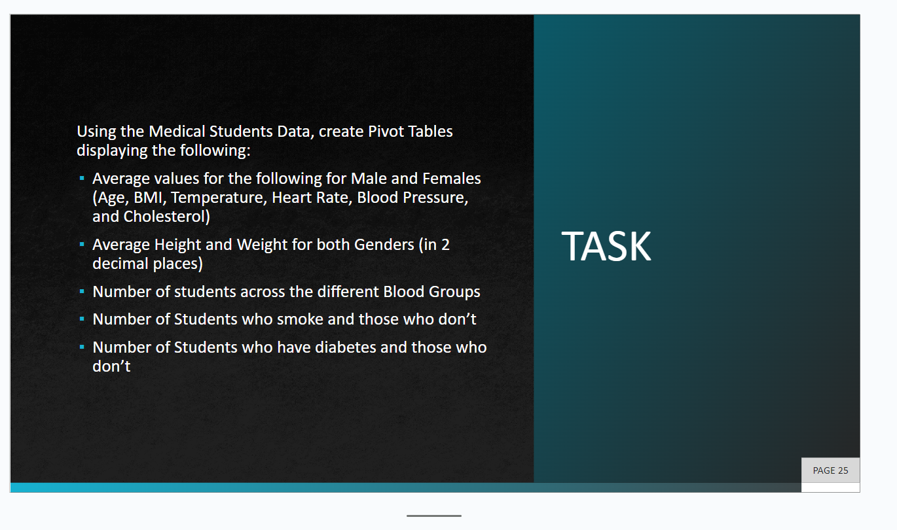
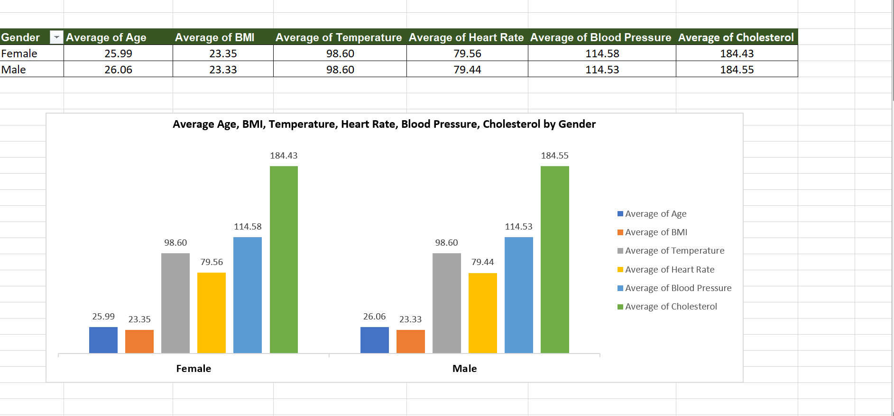
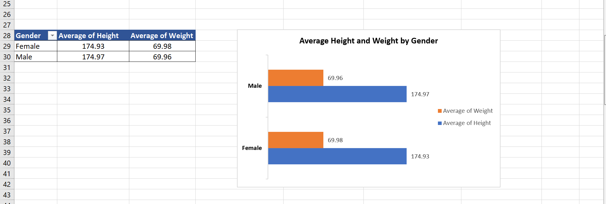
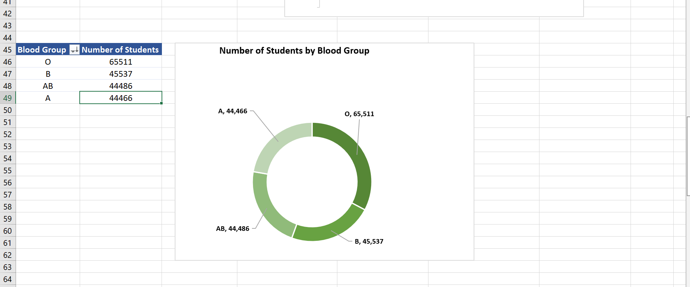
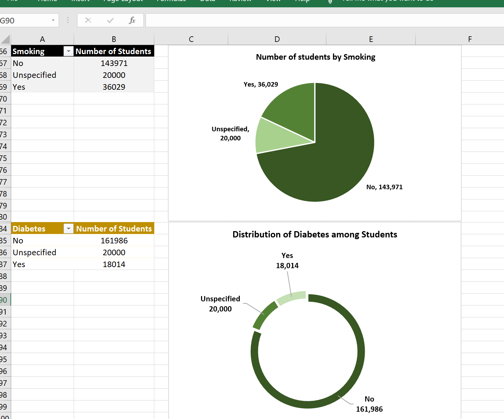

# "Exploring_the_Vital_Signs:A_Comprehensive_Analysis_of_Student_Health_and_Lifestyle Data
In the realm of academia, understanding the holistic well-being of students extends far beyond grades and textbooks. The "Exploring the Vital Signs" data analytics project delves into the intricacies of student health and lifestyle, harnessing the power of data to unveil patterns, correlations, and insights. 
This data analytics project stands as a testament to continuous learning and application in the field of data analysis. As part of a weekly task within a comprehensive data analysis training program, this endeavor not only sharpens analytical skills but also positions itself at the intersection of academia and practical insights.

## Data Cleaning
I initiated the process by importing the file into Excel, converting it from a CSV format. Subsequently, I established a user-friendly data table to facilitate seamless navigation. Recognizing the presence of numerous gaps in the data, I computed column averages for variables with values. Employing filters per column, I isolated the blanks and replaced them with the computed averages. In instances where values were entirely absent, I strategically inserted "Unspecified" to maintain data integrity.

## TASK: Crafting dynamic pivot tables and charts to distill key insights for a comprehensive understanding

## Answers 
In order to effectively interpret and showcase my data, I skillfully crafted multiple pivot tables and charts. 

1. The following visual representation highlights average values across various parameters, unveiling an intriguing revelation.While there is gender parity in BMI and Temperature, subtle distinctions emerge in Age, Heart Rate, Blood Pressure, and Cholesterol. This dynamic snapshot brings to light the nuanced differences within these vital health indicators.

2. Male heights tip the scales slightly higher than their female counterparts while females take the lead in weight metrics.

3. Our student community boasts a predominant prevalence of the "O" blood group, with the "A" blood group emerging as the least among our diverse population.

4. 18% of the student population smokes with 80% reported to haven't smoked before.
5. Also, approximately 9% of the population are Diabetic with 10% reported not knowing their diabetic status.

## Conclusions and Recommendations
On the whole, the data paints a positive picture of the well-being of a significant majority of medical students. Yet, in the pursuit of optimal health, a call for consistency resonates. For those on a path less optimal, a proactive stance beckons—prompt hospital visits coupled with unwavering adherence to medical prescriptions stand as potent recommendations for a holistic health turnaround.
Thank you for the read.
   
